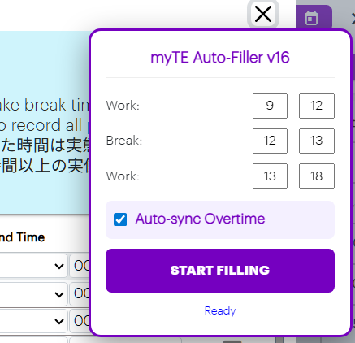
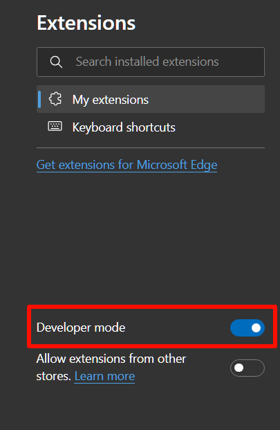
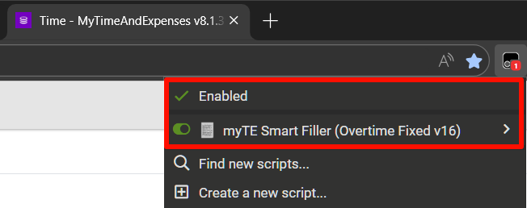

# MyTE Auto Filler (Tampermonkey)

This repository has a Tampermonkey userscript that auto-fills myTE working hours.
If you have overtime, the script can also synchronize it automatically.

## How to use

1. Install Tampermonkey in your browser.
2. Open this URL in your browser:

```text
https://raw.githubusercontent.com/ballban/MyTE_Auto_Filler/main/myte-smart-filler.user.js
```

3. Tampermonkey will open the install page. Click `Install`.
4. Reload the myTE page, then click `Working Hours`.
5. If the script is working, you will see something like this:
   
6. Click `START FILLING`!!

## Tampermonkey

1. Make sure `Developer mode` is enabled in your browser extension settings.
   
2. Make sure Tampermonkey and this script are enabled in the Tampermonkey menu.
   

## Update behavior

If you install from the `raw.githubusercontent.com` URL, Tampermonkey can check updates from the same URL.
